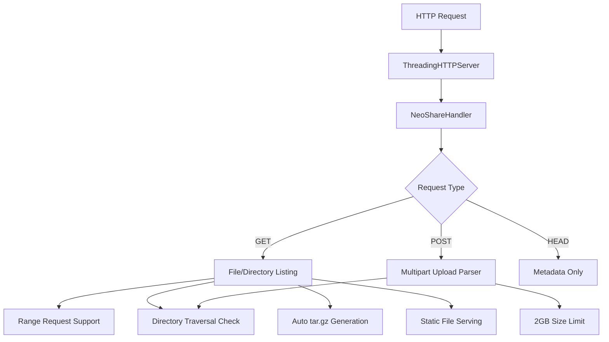

# NeoShare-Local-Cloud

A custom HTTP file server built from scratch with Zero Dependencies.

## Problem Statement

Python's built-in `http.server` is single-threaded and lacks security features needed for production file sharing. This project implements a secure, multi-threaded HTTP file server from scratch using only Python's standard library.

## Architecture



### Key Components

| Component | Responsibility |
|-----------|----------------|
| **ThreadingHTTPServer** | One thread per connection, non-blocking |
| **NeoShareHandler** | Custom request handler (GET, POST, HEAD) |
| **Path Sanitizer** | Directory traversal prevention |
| **Multipart Parser** | Streaming upload handling |
| **Range Handler** | HTTP Range support for video streaming |
| **Archive Generator** | Streaming tar.gz for directory downloads |

## Build & Run

### Prerequisites

- Python 3.7+ (standard library only)

### Installation

```bash
# Clone repository
git clone https://github.com/HitroBro/NeoShare-Local-Cloud.git
cd NeoShare-Local-Cloud

# Run (no dependencies!)
python server.py

# Custom port
python server.py 9000
# Or via environment
PORT=9000 python server.py
```

### Access

Open browser to `http://localhost:8000` (or your custom port)

## Features

- **Zero Dependencies** — Pure Python standard library
- **Multi-threaded** — One thread per connection
- **Security Hardened** — Path traversal protection, 2GB upload limit
- **Range Requests** — Video seeking/resume support
- **Auto Archive** — Streaming tar.gz for folder downloads
- **Drag & Drop Upload** — Modern HTML5 File API
- **Auto Theme** — Dark/light mode detection
- **Responsive UI** — Mobile-friendly

## Security

- **Path Traversal Protection** — Double normalization + prefix check
- **Upload Size Limit** — 2GB hard limit (configurable)
- **No Directory Listing Outside Root** — Chroot-like behavior

## Screenshots

*Coming soon — add screenshots of the web UI, upload progress, and video streaming*

## Configuration

Environment variables:

```bash
PORT=8000                    # Server port (default: 8000)
MAX_UPLOAD_SIZE=2147483648   # 2GB in bytes
BASE_DIR=/path/to/share      # Root directory to serve
```

## Roadmap

- [ ] Basic authentication support
- [ ] Symlink handling options
- [ ] Access logging
- [ ] WebDAV support

## License

MIT License — See [LICENSE](LICENSE) for details.

## Related Projects

- [async-tcp-gateway](https://github.com/HitroBro/async-tcp-gateway) — High-performance C networking
- [HitroBro.github.io](https://github.com/HitroBro/HitroBro.github.io) — Technical portfolio with interactive demos
- [Modern-YTDLP-GUI](https://github.com/HitroBro/Modern-YTDLP-GUI) — Desktop automation tool